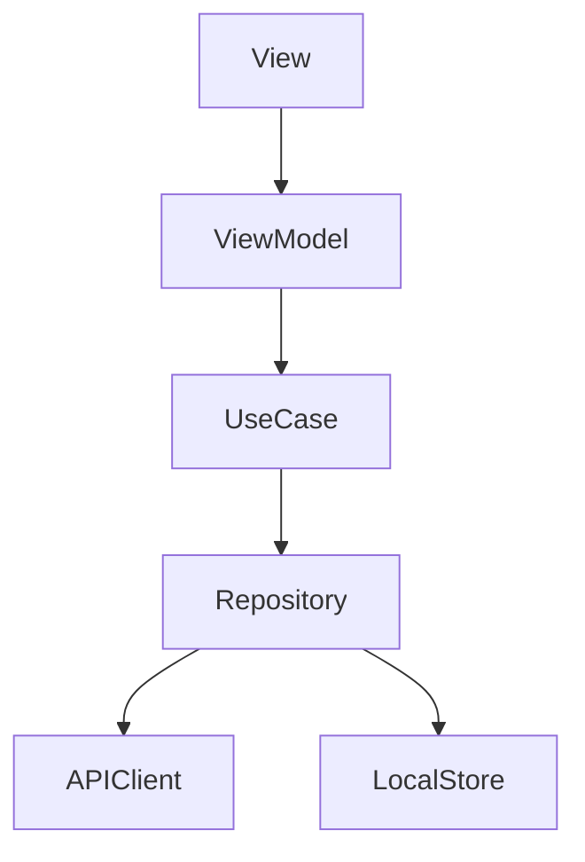
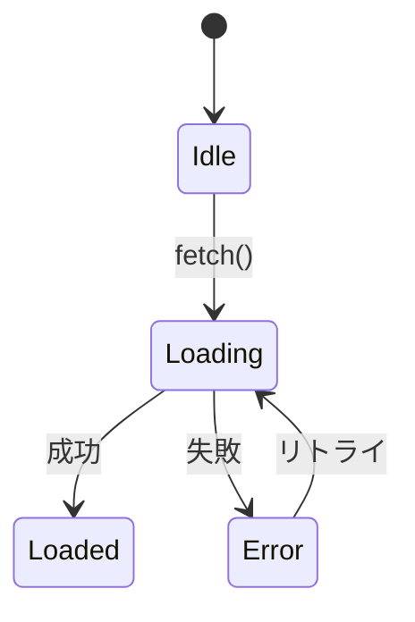
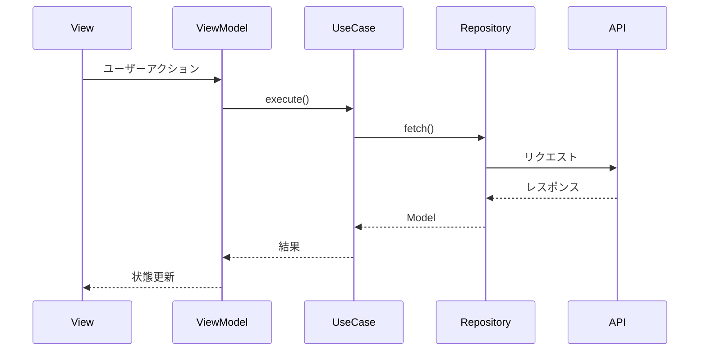
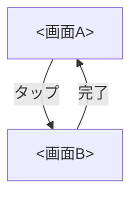

# 詳細設計書テンプレート

以下の構成に従い DESIGN.md を生成する。

---

```markdown
# <フィーチャー名> — 詳細設計書

## 1. アーキテクチャ概要

### レイヤー構成



### MVVM レイヤーの責務

| レイヤー | 責務 |
|---|---|
| View | UI の描画・ユーザーインタラクションのハンドリング |
| ViewModel | 状態管理・ビジネスロジックの呼び出し・UI 状態の変換 |
| UseCase | ビジネスロジックの実行（単一責務） |
| Repository | データアクセスの抽象化（API / ローカルストレージ） |
| Model | データ構造の定義 |

## 2. モジュール構成

### ディレクトリ構造

```
Sources/<フィーチャー名>Feature/
├── Views/
│   ├── <フィーチャー名>View.swift
│   └── Components/
│       └── <コンポーネント名>.swift
├── ViewModels/
│   └── <フィーチャー名>ViewModel.swift
├── Models/
│   └── <モデル名>.swift
├── Repositories/
│   ├── <フィーチャー名>RepositoryProtocol.swift
│   └── <フィーチャー名>Repository.swift
├── UseCases/
│   └── Fetch<フィーチャー名>UseCase.swift
├── Navigation/
│   └── <フィーチャー名>Router.swift
└── DI/
    └── <フィーチャー名>Dependency.swift
```

### SPM ターゲット

```swift
.target(
    name: "<フィーチャー名>Feature",
    dependencies: [
        // 依存するモジュールを列挙
    ],
    path: "Sources/<フィーチャー名>Feature"
)
```

## 3. View 設計

### コンポーネント一覧

| # | コンポーネント | 種別 | 概要 |
|---|---|---|---|
| V-1 | <フィーチャー名>View | Screen | メイン画面 |
| V-2 | <コンポーネント名> | Component | 再利用可能な UI パーツ |

### <フィーチャー名>View

```swift
struct <フィーチャー名>View: View {
    @State private var viewModel: <フィーチャー名>ViewModel

    var body: some View {
        // UI 構成の概要
    }
}
```

## 4. ViewModel 設計

### クラス一覧

| # | クラス | 概要 |
|---|---|---|
| VM-1 | <フィーチャー名>ViewModel | メイン画面の状態管理 |

### <フィーチャー名>ViewModel

```swift
@Observable
class <フィーチャー名>ViewModel {
    // MARK: - State
    var isLoading: Bool = false
    var errorMessage: String?
    // フィーチャー固有の状態

    // MARK: - Dependencies
    private let repository: <フィーチャー名>RepositoryProtocol

    // MARK: - Actions
    func fetch() async { ... }
}
```

### 状態遷移



## 5. Model 設計

### データモデル一覧

| # | モデル | 概要 |
|---|---|---|
| M-1 | <モデル名> | 〇〇のデータ構造 |

### <モデル名>

```swift
struct <モデル名>: Codable, Sendable, Identifiable {
    let id: String
    // プロパティ
}
```

## 6. Repository 設計

### Protocol

```swift
protocol <フィーチャー名>RepositoryProtocol: Sendable {
    func fetch() async throws -> [<モデル名>]
    func save(_ model: <モデル名>) async throws
}
```

### 具象実装

```swift
final class <フィーチャー名>Repository: <フィーチャー名>RepositoryProtocol {
    private let apiClient: APIClientProtocol

    func fetch() async throws -> [<モデル名>] {
        // API 呼び出し
    }
}
```

### データフロー



## 7. ナビゲーション設計

### 画面遷移



### Router

```swift
enum <フィーチャー名>Route: Hashable {
    case detail(id: String)
    case edit(id: String)
}
```

## 8. エラーハンドリング方針

| エラー種別 | ハンドリング |
|---|---|
| ネットワークエラー | リトライ UI を表示する |
| バリデーションエラー | フィールド単位でエラーメッセージを表示する |
| 認証エラー | ログイン画面へ遷移する |
| 不明なエラー | 汎用エラー画面を表示し、ログを送信する |

## 9. DI 構成

DI コンテナは Repository 等の依存物のみを管理する。ViewModel は View 側で `@State` として生成・保持し、ライフサイクルを View に紐づける。

```swift
struct <フィーチャー名>Dependency {
    let repository: <フィーチャー名>RepositoryProtocol

    static func resolve() -> <フィーチャー名>Dependency {
        let repository = <フィーチャー名>Repository()
        return .init(repository: repository)
    }
}

private struct <フィーチャー名>DependencyKey: EnvironmentKey {
    static let defaultValue: <フィーチャー名>Dependency = .resolve()
}

extension EnvironmentValues {
    var <フィーチャー名Camel>Dependency: <フィーチャー名>Dependency {
        get { self[<フィーチャー名>DependencyKey.self] }
        set { self[<フィーチャー名>DependencyKey.self] = newValue }
    }
}
```

View 側での使用例:

```swift
struct <フィーチャー名>View: View {
    @Environment(\.<フィーチャー名Camel>Dependency) private var dependency
    @State private var viewModel: <フィーチャー名>ViewModel

    init() {
        let dependency = <フィーチャー名>Dependency.resolve()
        _viewModel = State(initialValue: <フィーチャー名>ViewModel(repository: dependency.repository))
    }
}
```
```

---

## テンプレート使用時の注意

- 各セクションはフィーチャーに応じて取捨選択する。該当しないセクションは削除する
- コード例は必ず Swift 6.2 / SwiftUI の最新 API に準拠する
- `@Observable` を使用し、`ObservableObject` / `@Published` は使わない
- `@State` で ViewModel を保持し、`@StateObject` は使わない
- `@Environment` で DI を行い、`@EnvironmentObject` は使わない
- Mermaid 記法でダイアグラムを記述し、GitHub 上でのレンダリングに対応する
- 既存プロジェクトのパターンに合わせて調整する（特に DI・ナビゲーション）
