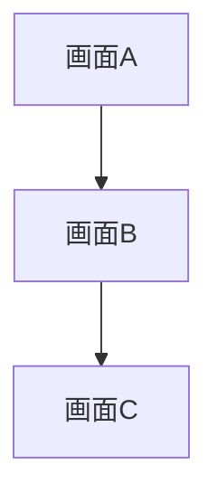

# 要件定義書テンプレート

以下の構成に従い REQUIREMENTS.md を生成する。

---

```markdown
# <フィーチャー名> — 要件定義書

## 1. 概要・背景

### 概要

<!-- フィーチャーの目的・実現する価値を 2-3 文で記述 -->

### 背景

<!-- なぜこのフィーチャーが必要か、ビジネス上の動機を記述 -->

## 2. 機能要件

### ユーザーストーリー

| # | ストーリー | 優先度 |
|---|---|---|
| US-1 | 〇〇として、△△できる。それにより□□。 | Must |
| US-2 | 〇〇として、△△できる。それにより□□。 | Should |

### 画面フロー

<!-- 画面遷移の概要を記述。Mermaid 記法推奨 -->



### 画面一覧

| # | 画面名 | 概要 |
|---|---|---|
| S-1 | 〇〇画面 | △△を表示する |
| S-2 | 〇〇画面 | △△を入力・送信する |

### 機能詳細

#### F-1: 〇〇機能

- 入力: 〇〇
- 処理: △△
- 出力: □□

## 3. 非機能要件

| # | カテゴリ | 要件 |
|---|---|---|
| NFR-1 | パフォーマンス | 画面遷移は 300ms 以内に完了する |
| NFR-2 | アクセシビリティ | VoiceOver に対応する。Dynamic Type をサポートする |
| NFR-3 | オフライン対応 | オフライン時はキャッシュデータを表示する |
| NFR-4 | セキュリティ | 個人情報は Keychain に保存する |
| NFR-5 | ローカライゼーション | 日本語・英語に対応する |

## 4. 外部依存

### API エンドポイント

| # | メソッド | パス | 概要 |
|---|---|---|---|
| API-1 | GET | /api/v1/xxx | 〇〇の一覧を取得する |
| API-2 | POST | /api/v1/xxx | 〇〇を作成する |

### サードパーティ SDK

| # | SDK | 用途 |
|---|---|---|
| SDK-1 | 〇〇 | △△のため |

## 5. 受け入れ条件

| # | 条件 | 検証方法 |
|---|---|---|
| AC-1 | 〇〇画面が表示される | 手動確認 |
| AC-2 | △△ボタンを押すと□□が実行される | ユニットテスト + 手動確認 |
| AC-3 | オフライン時にキャッシュが表示される | 手動確認 |
| AC-4 | VoiceOver で全要素が読み上げられる | アクセシビリティ監査 |

## 6. スコープ外

<!-- 今回のスコープに含めない項目を明示する -->

- 〇〇機能は次フェーズで対応する
- △△は既存機能で代替する
```

---

## テンプレート使用時の注意

- 各セクションはフィーチャーに応じて取捨選択する。該当しないセクションは削除する
- ユーザーストーリーは MoSCoW 優先度（Must / Should / Could / Won't）で分類する
- 画面フローは Mermaid 記法で記述し、GitHub 上でのレンダリングに対応する
- API エンドポイントは既存の API 仕様がある場合はそれに準拠する
- 受け入れ条件は具体的かつ検証可能な形で記述する
