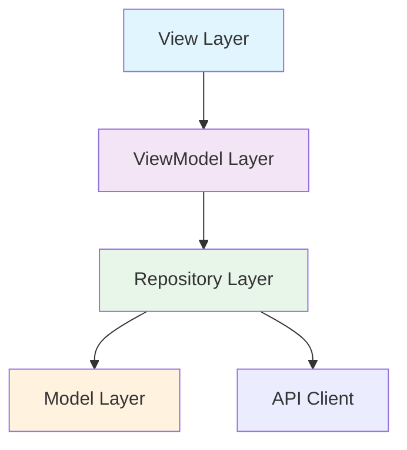
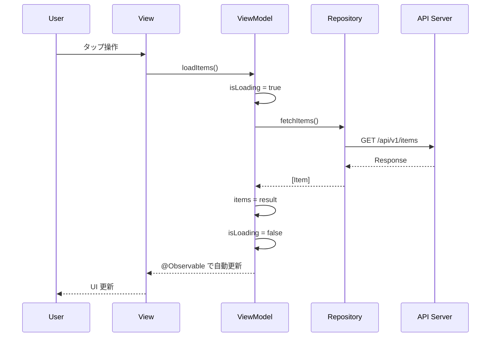

# アーキテクチャ設計書テンプレート

以下のテンプレートに従って `docs/architecture.md` を生成する。

---

```markdown
# アーキテクチャ設計書

> 生成日時: YYYY-MM-DD
> ステータス: Draft
> 入力: docs/product-requirements.md, docs/functional-design.md

## 1. アーキテクチャ概要



### 各レイヤーの責務

| レイヤー | 責務 | 依存先 |
|---|---|---|
| View | UI 表示・ユーザー操作のハンドリング | ViewModel |
| ViewModel | 状態管理・ビジネスロジックの実行 | Repository |
| Repository | データアクセスの抽象化 | Model, API Client |
| Model | データ構造の定義 | なし |

## 2. 技術スタック

| 技術 | 用途 | 選定理由 |
|---|---|---|
| Swift 6.2 | 言語 | 最新の Concurrency サポート |
| SwiftUI | UI フレームワーク | 宣言的 UI、iOS 17+ |
| Observation | 状態管理 | `@Observable` によるシンプルな状態管理 |
| Swift Concurrency | 非同期処理 | `async/await`, `Sendable` による安全な並行処理 |
| XcodeGen | プロジェクト生成 | `project.yml` による宣言的なプロジェクト管理 |

## 3. レイヤー設計

### 3.1 View 層

```swift
struct HomeView: View {
    @State private var viewModel = HomeViewModel()

    var body: some View {
        NavigationStack {
            List(viewModel.items) { item in
                ItemRow(item: item)
            }
            .task {
                await viewModel.loadItems()
            }
        }
    }
}
```

**設計方針:**
- `@State` で ViewModel のオーナーシップを持つ
- `@Bindable` で子 View に双方向バインディングを提供する
- `@Environment` で依存を注入する
- View にビジネスロジックを記述しない

### 3.2 ViewModel 層

```swift
@Observable
final class HomeViewModel {
    private(set) var items: [Item] = []
    private(set) var isLoading = false
    private(set) var error: AppError?

    private let repository: any ItemRepositoryProtocol

    init(repository: any ItemRepositoryProtocol = ItemRepository()) {
        self.repository = repository
    }

    @MainActor
    func loadItems() async {
        isLoading = true
        defer { isLoading = false }
        do {
            items = try await repository.fetchItems()
        } catch {
            self.error = AppError(error)
        }
    }
}
```

**設計方針:**
- `@Observable` マクロを使用する（`ObservableObject` は非推奨）
- 状態プロパティは `private(set)` で外部からの直接変更を防ぐ
- アクションメソッドは `async` で定義する
- `@MainActor` を UI 更新メソッドに適用する

### 3.3 Repository 層

```swift
protocol ItemRepositoryProtocol: Sendable {
    func fetchItems() async throws -> [Item]
    func createItem(_ item: Item) async throws -> Item
}

final class ItemRepository: ItemRepositoryProtocol {
    private let apiClient: APIClient

    init(apiClient: APIClient = .shared) {
        self.apiClient = apiClient
    }

    func fetchItems() async throws -> [Item] {
        try await apiClient.request(ItemsEndpoint.list)
    }
}
```

**設計方針:**
- Protocol で抽象化し、テスト時に Mock に差し替え可能にする
- `Sendable` に準拠する
- `async throws` メソッドで定義する

### 3.4 Model 層

```swift
struct Item: Codable, Sendable, Identifiable {
    let id: String
    let title: String
    let description: String?
    let createdAt: Date
}
```

**設計方針:**
- `Codable`, `Sendable`, `Identifiable` に準拠する struct
- イミュータブル（`let`）を基本とする

## 4. DI 戦略

```swift
// EnvironmentKey の定義
private struct ItemRepositoryKey: EnvironmentKey {
    static let defaultValue: any ItemRepositoryProtocol = ItemRepository()
}

extension EnvironmentValues {
    var itemRepository: any ItemRepositoryProtocol {
        get { self[ItemRepositoryKey.self] }
        set { self[ItemRepositoryKey.self] = newValue }
    }
}

// View での使用
struct HomeView: View {
    @Environment(\.itemRepository) private var repository

    var body: some View {
        // ...
    }
}
```

**注意:** `@EnvironmentObject` は使用しない。`@Environment` + `EnvironmentKey` パターンを使う。

## 5. ナビゲーション設計

```swift
enum AppRoute: Hashable {
    case home
    case detail(itemID: String)
    case settings
}

struct ContentView: View {
    @State private var path = NavigationPath()

    var body: some View {
        NavigationStack(path: $path) {
            HomeView()
                .navigationDestination(for: AppRoute.self) { route in
                    switch route {
                    case .home:
                        HomeView()
                    case .detail(let itemID):
                        DetailView(itemID: itemID)
                    case .settings:
                        SettingsView()
                    }
                }
        }
    }
}
```

## 6. エラーハンドリング方針

### エラー分類

| 種別 | 例 | UI 表現 |
|---|---|---|
| ネットワーク | 通信エラー、タイムアウト | リトライボタン付きアラート |
| バリデーション | 入力値不正 | インラインエラーメッセージ |
| 認証 | トークン期限切れ | ログイン画面に遷移 |
| 不明 | 予期しないエラー | 汎用エラーダイアログ |

### エラー型定義

```swift
enum AppError: Error, Sendable {
    case network(NetworkError)
    case validation(String)
    case authentication
    case unknown(Error)

    init(_ error: Error) {
        // エラーの分類ロジック
    }
}
```

## 7. データフロー図



## 8. テスト戦略

### ViewModel テスト

```swift
@Test
func loadItems_success() async {
    let mockRepository = MockItemRepository(items: [.mock])
    let viewModel = HomeViewModel(repository: mockRepository)

    await viewModel.loadItems()

    #expect(viewModel.items.count == 1)
    #expect(viewModel.isLoading == false)
    #expect(viewModel.error == nil)
}
```

### Mock の作り方

```swift
final class MockItemRepository: ItemRepositoryProtocol {
    let items: [Item]
    let error: Error?

    init(items: [Item] = [], error: Error? = nil) {
        self.items = items
        self.error = error
    }

    func fetchItems() async throws -> [Item] {
        if let error { throw error }
        return items
    }
}
```
```
