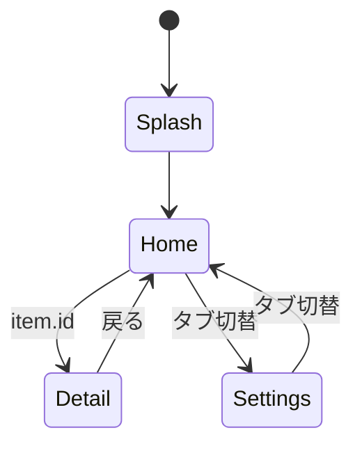
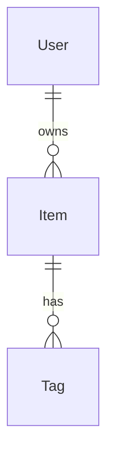

# 機能設計書テンプレート

以下のテンプレートに従って `docs/functional-design.md` を生成する。

---

```markdown
# 機能設計書

> 生成日時: YYYY-MM-DD
> ステータス: Draft
> 入力: docs/product-requirements.md

## 1. 画面一覧

| # | 画面名 | 概要 | 主要コンポーネント |
|---|---|---|---|
| S-001 | ホーム画面 | メインコンテンツ一覧 | List, NavigationBar, TabBar |
| S-002 | 詳細画面 | コンテンツ詳細表示 | ScrollView, Image, Text |

## 2. 画面詳細仕様

### 2.1 ホーム画面（S-001）

#### レイアウト構成

```
NavigationStack
├── List
│   └── ForEach(items)
│       └── ItemRow
│           ├── AsyncImage
│           ├── VStack
│           │   ├── Text (title)
│           │   └── Text (subtitle)
│           └── Spacer
└── .navigationTitle("ホーム")
```

#### 状態一覧

| プロパティ | 種別 | 型 | 説明 |
|---|---|---|---|
| viewModel | @State | HomeViewModel | 画面の ViewModel |
| searchText | @State | String | 検索テキスト |
| isLoading | computed | Bool | viewModel.isLoading |

#### ユーザーインタラクション

| アクション | 結果 |
|---|---|
| リスト項目タップ | 詳細画面に遷移（item.id を渡す） |
| プルリフレッシュ | viewModel.refresh() を呼び出し |
| 検索テキスト入力 | viewModel.search(query:) を呼び出し |

#### エラー状態

| エラー種別 | 表示 |
|---|---|
| ネットワークエラー | リトライボタン付きエラービュー |
| 空データ | 「データがありません」メッセージ |

## 3. 画面遷移仕様



### 遷移パラメータ

| 遷移元 | 遷移先 | パラメータ | 型 |
|---|---|---|---|
| Home | Detail | itemID | String |

## 4. データモデル一覧

### 4.1 エンティティ定義

| エンティティ | プロパティ | 型 | 制約 |
|---|---|---|---|
| Item | id | String | Identifiable |
| Item | title | String | 必須 |
| Item | description | String | 任意 |
| Item | createdAt | Date | 必須 |

### 4.2 エンティティ関連図



### 4.3 Swift 型定義例

```swift
struct Item: Codable, Sendable, Identifiable {
    let id: String
    let title: String
    let description: String?
    let createdAt: Date
}
```

## 5. API インターフェース仕様

### 5.1 GET /api/v1/items

#### リクエスト

| パラメータ | 型 | 必須 | 説明 |
|---|---|---|---|
| page | Int | 任意 | ページ番号（デフォルト 1） |
| query | String | 任意 | 検索クエリ |

#### レスポンス

```swift
struct ItemsResponse: Codable, Sendable {
    let items: [Item]
    let totalCount: Int
    let hasNext: Bool
}
```

## 6. 共通コンポーネント

| コンポーネント | 概要 | 使用画面 |
|---|---|---|
| ErrorView | リトライボタン付きエラー表示 | 全画面 |
| LoadingView | ローディングインジケーター | 全画面 |
| EmptyView | 空データ表示 | リスト画面 |
```
