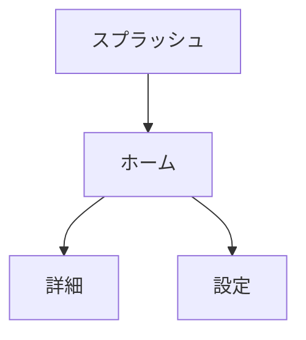

# プロダクト要求定義書テンプレート

以下のテンプレートに従って `docs/product-requirements.md` を生成する。

---

```markdown
# プロダクト要求定義書

> 生成日時: YYYY-MM-DD
> ステータス: Draft / Approved

## 1. プロダクト概要

### 1.1 目的
<!-- アプリが解決する課題 -->

### 1.2 ターゲットユーザー
<!-- 主要なペルソナ -->

### 1.3 解決する課題
<!-- ユーザーが抱える具体的な課題 -->

## 2. ユーザーストーリー一覧

| # | 優先度 | ストーリー | 受け入れ条件 |
|---|---|---|---|
| US-001 | Must | 〜として、〜したい、なぜなら〜 | 〜が確認できること |
| US-002 | Should | 〜として、〜したい、なぜなら〜 | 〜が確認できること |
| US-003 | Could | 〜として、〜したい、なぜなら〜 | 〜が確認できること |

### 優先度の定義（MoSCoW）
- **Must**: リリースに必須
- **Should**: 重要だがリリースブロッカーではない
- **Could**: あれば嬉しい
- **Won't**: 今回のスコープ外

## 3. 画面フロー



## 4. 機能要件

### 4.1 画面名

| 項目 | 内容 |
|---|---|
| 入力 | ユーザーが入力する情報 |
| 処理 | システムが行う処理 |
| 出力 | 画面に表示する結果 |

## 5. 非機能要件

| カテゴリ | 要件 |
|---|---|
| パフォーマンス | 画面遷移は 300ms 以内 |
| アクセシビリティ | VoiceOver 対応、Dynamic Type 対応 |
| オフライン対応 | キャッシュによるオフライン閲覧 |
| セキュリティ | 認証トークンは Keychain に保存 |
| ローカライゼーション | 日本語（初期リリース） |

## 6. 外部依存

### 6.1 API エンドポイント

| メソッド | パス | 概要 |
|---|---|---|
| GET | /api/v1/items | アイテム一覧取得 |
| POST | /api/v1/items | アイテム作成 |

### 6.2 サードパーティ SDK

| SDK | 用途 | バージョン |
|---|---|---|
| - | - | - |

## 7. 受け入れ条件

| # | 条件 | 検証方法 |
|---|---|---|
| AC-001 | 〜が表示されること | 画面を開いて確認 |
| AC-002 | 〜が保存されること | 操作後にデータを確認 |

## 8. 成功指標（KPI）

| 指標 | 目標値 | 計測方法 |
|---|---|---|
| DAU | X 人 | Analytics |
| クラッシュフリー率 | 99.9% | Crashlytics |

## 9. スコープ外

- 今回のリリースに含めない項目をリスト化する
```
